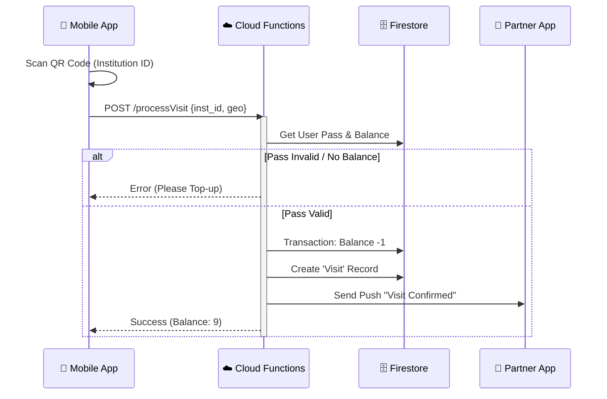

# System Architecture & Technical Specification (KidSpace 5.0)

Этот документ является **Master-спецификацией**, объединяющей все архитектурные решения (Payments, Analytics, Compliance, Logic) в единую структуру реального MVP.

---

## 1. High-Level Architecture (C4 Model: Container Level)

```mermaid
graph TD
    User[📱 User (Mobile/Web)]
    Partner[🏢 Partner (Web Admin)]
    Doctor[👨‍⚕️ Doctor (Web/Mobile)]

    subgraph "KidSpace Ecosystem (Firebase)"
        UI[FlutterFlow / React App]
        Auth[Firebase Auth]
        DB[(Firestore NoSQL)]
        Storage[Cloud Storage]
        
        subgraph "Backend Logic (Cloud Functions)"
            FnPay[Payment Gateway]
            FnPass[Pass Manager]
            FnHealth[Health Logic]
            FnNotify[Notification Engine]
        end
        
        subgraph "Analytics & AI"
            GA[Firebase Analytics]
            BQ[(BigQuery)]
            Gemini[Gemini 2.0 Flash]
        end
    end

    subgraph "External Providers"
        Payme[💳 Payme / Click]
        Maps[📍 Google Maps API]
    end

    User --> UI
    Partner --> UI
    Doctor --> UI
    
    UI -->|Auth| Auth
    UI -->|Read/Write| DB
    UI -->|AI Chat| Gemini
    UI -->|Uploads| Storage
    
    UI -->|API Calls| FnPay
    
    FnPay -->|Webhook| Payme
    FnPay -->|Write| DB
    
    FnPass -->|Scheduled| DB
    FnPass -->|Trigger| FnNotify
    
    DB -->|Stream| GA
    GA -->|Export| BQ
```

---

## 2. Technology Stack

| Уровень | Технология | Обоснование |
| :--- | :--- | :--- |
| **Frontend** | React 19 (Web) + Tailwind CSS | Высокая производительность, SEO для каталога, PWA. |
| **Mobile** | FlutterFlow (Flutter) | Быстрая разработка кросс-платформенного нативного приложения. |
| **Backend** | Firebase Cloud Functions (Node.js) | Serverless, масштабируемость, оплата за вызовы. |
| **Database** | Cloud Firestore | Realtime обновления, гибкая схема данных. |
| **Analytics** | BigQuery + Firebase Analytics | Хранение логов, сложные SQL-запросы для RFM/LTV. |
| **AI** | Google Gemini 2.0 Flash | Быстрый, дешевый, мультимодальный (текст + картинки). |
| **Payments** | Payme / Click API | Стандарт рынка Узбекистана. |

---

## 3. Модульная структура (Module Integration)

Система разделена на изолированные модули, описанные в отдельных спецификациях.

| Модуль | Ключевая функция | Ссылка на документ |
| :--- | :--- | :--- |
| **Core / Auth** | Единый профиль семьи, управление детьми. | `FIREBASE_SCHEMA.md` |
| **Kidspace Pass** | Управление подписками, QR-списание визитов. | `BUSINESS_LOGIC.md` |
| **Directory** | Каталог с поиском, фильтрами и картой. | `UI_FLOWS.md` |
| **Health+** | Телемедицина, чаты, видеозвонки, назначения. | `COMPLIANCE.md` |
| **Marketplace** | E-commerce корзина, заказы, доставка. | `FIREBASE_SCHEMA.md` |
| **Payments** | Шлюз оплаты, кошелек, рекуррентные списания. | `PAYMENTS_ARCHITECTURE.md` |
| **Analytics** | Сбор событий, расчет KPI, дашборды. | `ANALYTICS.md` |

---

## 4. Пример реальной модели данных (JSON Data Flow)

Ниже представлен агрегированный объект состояния пользователя ("User State"), который собирается из разных коллекций для отображения профиля.

```json
{
  "user_profile": {
    "uid": "user_001",
    "name": "Азиза Каримова",
    "role": "parent",
    "wallet_balance": 150000,
    "region": { "city": "Tashkent", "lat": 41.2995, "lng": 69.2401 }
  },
  "active_subscriptions": {
    "kidspace_pass": {
      "id": "pass_999",
      "plan": "Active (10 visits)",
      "balance": 4,
      "status": "active",
      "expiry": "2023-12-31T23:59:59Z",
      "qr_code_payload": "ey...encrypted_token"
    },
    "health_plus": {
      "status": "active",
      "doctor_assigned": "Dr. Alisher",
      "consultations_left": 2
    }
  },
  "family_context": [
    {
      "id": "child_1",
      "name": "Али",
      "age": 7,
      "interests": ["Robotics", "Football"],
      "metrics": { "monthly_activity": "High" }
    }
  ],
  "current_context": {
    "cart_items_count": 2,
    "unread_messages": 1,
    "pending_bookings": [
      { "id": "bk_55", "place": "RoboKids", "time": "Tomorrow 14:00" }
    ]
  }
}
```

---

## 5. Sequence Diagram: QR Payment Flow

Реализация сценария списания визита (самая критичная операция).



---

## 6. Безопасность и Масштабируемость (Infrastructure)

### Security Layers
1.  **App Check:** Защита API от несанкционированных вызовов (не из нашего приложения).
2.  **Firestore Rules:** Строгое разграничение доступа (см. `FIREBASE_SECURITY_RULES.md`).
3.  **PII Encryption:** Шифрование медицинских данных на уровне приложения перед отправкой.

### Scalability Strategy
*   **Sharding:** Для коллекции `payments` и `visits` при превышении 1 млн записей в день (на будущее).
*   **Caching:** Агрегированные данные (рейтинги, счетчики) обновляются фоновыми триггерами, а клиент читает готовые значения (Read-heavy architecture).
*   **CDN:** Изображения и статика раздаются через Firebase Hosting Global CDN.

---

## 7. Результат (Definition of Done)

MVP считается готовым, когда реализованы:
1.  ✅ **Auth:** Вход по телефону.
2.  ✅ **Pass:** Покупка пакета и успешное сканирование QR.
3.  ✅ **Catalog:** Поиск школы/сада и просмотр карточки.
4.  ✅ **Payments:** Интеграция хотя бы одного провайдера (симуляция).
5.  ✅ **Admin:** Возможность админу верифицировать партнера.
